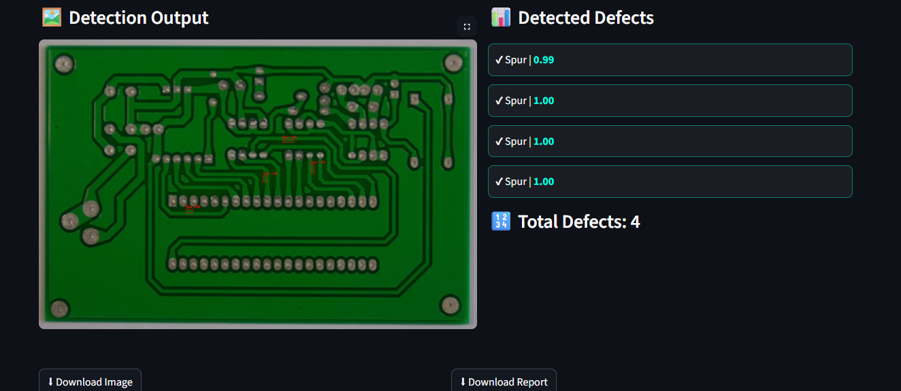

# PCB Defect Detection System

## Overview

This project focuses on detecting and classifying defects in Printed Circuit Boards (PCBs) using a combination of image processing and deep learning.

The system compares a reference (template) PCB image with a test image to identify differences, localizes defect regions, and classifies them into specific defect types using a trained neural network model.

The goal is to build a reliable and scalable solution for automated PCB inspection.

---

## Features

- Upload template and test PCB images  
- Detect defects using image subtraction  
- Refine detection using thresholding and morphological operations  
- Extract defect regions using contour detection  
- Classify defects using a trained EfficientNet model  
- Display results with bounding boxes and confidence scores  
- Download annotated output image and CSV report  

---

## Sample Results

### User Interface


### Detection Output

  


### Intermediate Processing

     

---

## Approach

The system follows a two-stage pipeline:

### 1. Defect Localization (Image Processing)

- Convert images to grayscale  
- Resize images for alignment  
- Perform image subtraction to highlight differences  
- Apply Gaussian blur to reduce noise  
- Use Otsu’s thresholding to segment defect regions  
- Apply morphological operations to refine detection  
- Detect contours to locate defect regions  

### 2. Defect Classification (Deep Learning)

- Extract regions of interest (ROI) from detected areas  
- Resize inputs to 128×128  
- Pass ROIs through a trained EfficientNet-B0 model  
- Predict defect class with confidence score  

### Additional Refinement

A rule-based step is used for certain defect types (such as open vs short circuits) using edge density and shape features to improve prediction consistency.

---

## Model Performance

- Training Accuracy: ~99%  
- Validation Accuracy: ~98.6%  
- Test Accuracy: ~98.8%  

---

## Tech Stack

- Python  
- OpenCV  
- PyTorch  
- EfficientNet (timm)  
- Streamlit  

---

## Project Structure

```
app/                # Streamlit frontend
backend/            # Detection and inference pipeline
models/             # Trained model weights
assets/             # Images for README
notebooks/          # Training and experiments
requirements.txt
README.md
```

---

## How to Run

```bash
pip install -r requirements.txt
streamlit run app/app.py
```

---

## Dataset

The dataset used in this project includes:

- Template PCB images  
- Test PCB images  
- Annotation files (bounding boxes)  

Due to sharing restrictions, the dataset is not included in this repository.

---

## Notes

- Combines classical computer vision with deep learning  
- Designed as a complete end-to-end pipeline  
- Handles both detection and classification  
- Built with focus on clarity and practical usability  

---

## Future Improvements

- Improve image alignment for better subtraction results  
- Expand dataset with more real-world variations  
- Explore advanced models for faster inference  
- Deploy as a scalable web service  

---

## Author

**Anitha Baikani**
